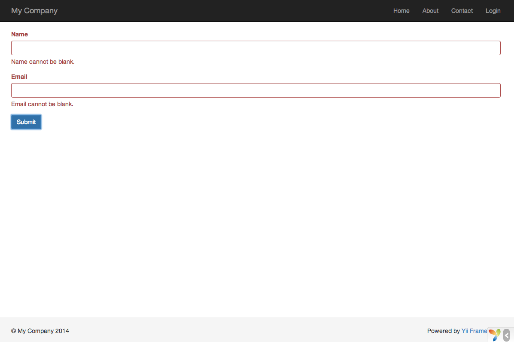

Arbeiten mit Formularen
=======================
Dieses Kapitel beschreibt wie Sie eine neue Seite mit einem Formular erstellen können um Daten von Besuchern einzuholen.
Die Seite wird ein Formular anzeigen mit einem Feld für den Namen und einem für die Mail-Adresse.
Nach dem einholen dieser Informationen wird die Seite diese zur Bestätigung wieder anzeigen.

Um dieses Ziel zu erreichen werden wir neben einer [Aktion](structure-controllers.md) und einer [View](structure-views.md) 
auch ein [Model](structure-models.md) erstellen.

In diesem Tutorial lernen Sie:
* ein [Model](structure-models.md) zu erstellen welches die Daten des Formulars repräsentiert,
* Regeln zu definieren um die eingegebenen Daten zu validieren,
* ein HTML Formular innerhalb einer [View](structure-views.md) zu erstellen.

Ein Model erstellen <span id="creating-model"></span>
-------------------

Die vom User abgefragten Daten werden von einer Model Klasse names `EntryForm` repräsentiert. Diese wird in der Datei
`models/EntryForm.php` erstellt. Mehr Informationen zu den Namenskonventionen erhalten Sie unter 
[Class Autoloading](concept-autoloading.md).

```php
<?php

namespace app\models;

use Yii;
use yii\base\Model;

class EntryForm extends Model
{
    public $name;
    public $email;

    public function rules()
    {
        return [
            [['name', 'email'], 'required'],
            ['email', 'email'],
        ];
    }
}
```

Die Klasse erbt von [[yii\base\Model]]. Dies ist eine Basisklasse von Yii, meist benutzt um Formulardaten abzubilden.

> Info: [[yii\base\Model]] wird als Basis verwendet für Model Klassen welche *nicht* assoziiert sind mit einer Datenbank.
  [[yii\db\ActiveRecord]] wird meist als Basis verwendet für Model Klassen welche eine Datenbanktabelle abbilden.
  
Die Klasse `EntryForm` enthält die zwei öffentliche Eigenschaften `name` und `email`, in welche die vom Besucher eingegebenen
Daten gespeichert werden. Sie enthält ausserdem die Methode `rules()` welche eine Definition an Regeln zurückgibt die
Benutzt werden zur Validierung der Daten. Die Validierungsregeln oben besagen dass:

* `name` sowie `email` ausgefüllt werden müssen
* `email` muss syntaktisch eine E-Mail Adresse abbilden

Wenn Sie ein `EntryForm`-Objekt füllen mit den Eingaben eines Besuchers, können Sie seine Methode 
[[yii\base\Model::validate()|validate()]] auslösen um die eingegebenen Daten zu validieren. Ein allfälliger Validierungsfehler
wird die Eigenschaft [[yii\base\Model::hasErrors|hasErrors]] auf `true` setzen und Sie können diese Fehlermeldungen
abfragen mittels [[yii\base\Model::getErrors|errors]].

```php
<?php
$model = new EntryForm();
$model->name = 'Qiang';
$model->email = 'bad';
if ($model->validate()) {
    // Good!
} else {
    // Failure!
    // Use $model->getErrors()
}
```

Erstellen einer Aktion <span id="creating-action"></span>
----------------------

Als nächstes müssen Sie eine Aktion `entry` innerhalb des `site` Controllers erstellen, welche das neue Model verwenden wird.
Der Prozess zur Erstellung und Verwendung von Actions wurde erklärt im Kapitel [Hallo sagen](start-hello.md).

```php
<?php

namespace app\controllers;

use Yii;
use yii\web\Controller;
use app\models\EntryForm;

class SiteController extends Controller
{
    // ...existing code...

    public function actionEntry()
    {
        $model = new EntryForm();

        if ($model->load(Yii::$app->request->post()) && $model->validate()) {
            // valid data received in $model

            // do something meaningful here about $model ...

            return $this->render('entry-confirm', ['model' => $model]);
        } else {
            // either the page is initially displayed or there is some validation error
            return $this->render('entry', ['model' => $model]);
        }
    }
}
```

Die Aktion erstellt erst ein `EntryForm` Objekt. Sie versucht dann das Objekt mit den Daten von `$_POST`, welche in Yii
abgerufen werden können mit [[yii\web\Request::post()]], zu füllen. Wenn das Objekt die Daten erfolgreich laden konnte
(z.B. wenn der Besucher das Formular abgeschickt hat), wird die Aktion die [[yii\base\Model::validate()|validate()]]
Methode aufrufen, um zu prüfen dass die eingebenen Werte gültig sind.

> Info: Der Ausdruck `Yii::$app` repräsentiert die [Applikations](structure-applications.md)-Instanz welche ein globales
  Singleton darstellt. Er entpsricht ebenso einem [Service Locator](concept-service-locator.md), welcher Komponenten wie
  `request`, `response`, `db` etc. und die entsprechende Funktionalität zur Verfügung stellt. In obigem Code wird die
  `request`-Komponente der Applikationsinstanz verwendet, um Zugriff auf die `$_POST`-Daten zu erhalten.
  
Wenn alles geklappt hat rendert die Aktion eine View mit Namen `entry-confirm` zur Bestätigung der erfolgreichen 
Datenübertragung des Besuchers. Wenn keine Daten übetragen wurden oder die Daten fehlerhaft waren wird die `entry`-View
gerendert, in welcher das HTML-Formular dargestellt wird mit allfälligen Fehlermeldungen.

> Hinweis: In diesem doch sehr einfachen Beispiel rendern wir lediglich die Bestätigungsseite nach einer erfolgreichen
  Datenübermittlung. In der Praxis sollten Sie die Verwendung von [[yii\web\Controller::refresh()|refresh()]] bzw.
  [[yii\web\Controller::redirect()|redirect()]] in Erwägung ziehen um
  [wiederholte Übermittlungen](https://de.wikipedia.org/wiki/Post/Redirect/Get) zu vermeiden.
  
Erstellen von Views <span id="creating-views"></span>
-------------------

Erstellen Sie zum Schluss zwei View Dateien mit den Namen `entry-confirm` bzw `entry`. Diese werden innerhalb der `entry`
Aktion gerendert (wie eben beschrieben).

Die `entry-confirm`-View zeigt lediglich den eingebenen Namen und die E-Mail Adresse wieder an. Sie sollte gespeichert
werden unter `views/site/entry-confirm.php`:

```php
<?php
/* @var $model app\models\EntryForm */

use yii\helpers\Html;
?>
<p>You have entered the following information:</p>

<ul>
    <li><label>Name</label>: <?= Html::encode($model->name) ?></li>
    <li><label>Email</label>: <?= Html::encode($model->email) ?></li>
</ul>
```

Die `entry`-View zeigt das HTML-Fomular an. Sie sollte gespeichert werden unter `views/site/entry.php`:

```php
<?php
/* @var $model app\models\EntryForm */

use yii\helpers\Html;
use yii\widgets\ActiveForm;
?>
<?php $form = ActiveForm::begin(); ?>

    <?= $form->field($model, 'name') ?>

    <?= $form->field($model, 'email') ?>

    <div class="form-group">
        <?= Html::submitButton('Submit', ['class' => 'btn btn-primary']) ?>
    </div>

<?php ActiveForm::end(); ?>
```

Die View verwendet ein mächtiges [Widget](structure-widgets.md) namens [[yii\widget\ActiveForm|ActiveForm]] um das
HTML-Formular zu generieren. Die `begin()` und `end()` Methoden des Widgets rendern die öffnenden bzw. schliessenden
`form` Tags. Zwischen diesen diesen zwei Methodenaufrufen werden die Input-Felder erstellt mittels der
[[yii\widgets\ActiveForm::field()|field()]] Methode. Das erste Input-Feld ist für Das "name"-Attribut, das zweite für
das "email"-Attribut. Nach den Input-Feldern wird die [[yii\helpers\Html::submitButton()]] Methode verwendet um den
sogenannten Submit-Button zu generieren.

Testen <span id="trying-it-out"></span>
------

Öffnen Sie in Ihrem Browser folgende URL um das Ganze zu testen:

```
http://hostname/index.php?r=site%2Fentry
```

Sie sehen ein Formular welches aus zwei Input-Feldern besteht. Vor jedem Feld sehen Sie ein Label, welches anzeigt, was
für Daten in das jeweilige Feld eingegeben werden sollen. Wenn Sie auf den Submit-Button klicken ohne irgendwelche Daten
einzugeben oder keine gültige E-Mail Adresse eingeben, sehen Sie eine Fehlermeldung in Folge jedes Input-Feldes, welches
ungültige Daten enthält.



Nach der Eingabe von eines gültigen Namens und einer gültigen E-Mail Adresse und des Klickens auf den Submit-Button sehen
Sie die Daten, die Sie eben eingegeben haben.


### Die Magie erklärt <span id="magic-explained"></span>

Möglicherweise wundern Sie sich nun, dass das HTML-Formular anstandslos funktioniert, weil es fast magisch wirkt dass es
Labels vor jedem Feld sowie Fehlermeldungen anzeigt wenn falsche Daten eingegeben werden und das ohne die Seite neu zu
laden.

Ja es ist so, die Validierung wird im ersten Schritt auf Seite des Clients mittels JavaScript ausgeführt und erst danach
auf dem Server mittels PHP. [[yii\widgets\ActiveForm]] ist smart genug um die entsprechenden Validierungsregeln, welche
Sie in der `EntryForm`-Klasse definiert haben, in ausführbaren JavaScript-Code umzuwandeln. Falls Sie JavaScript in Ihrem
Browser deaktiviert haben, wird die Validierung immer noch auf dem Server ausgeführt (wie gezeigt in der `actionEntry()`
Methode). Dies gewährleistet eine Validierung unter allen Umständen.

> Warnung: Die Clientseitige Validierung dient lediglich der besseren Nutzer-Erfahrung. Die Serverseitige Validierung 
  wird immer benötigt, ob nun die Cleintseitige Validierung aktiv war oder nicht.
  
Die Labels der Input-Felder werden generiert von der `field()`-Methode unter verwendung des Attributnamens im Model.
So wird beispielsweise das Label `Name` generiert aus dem Attribut `name`.

Sie können ein Label anpassen mittels folgendem Code:

```php
<?= $form->field($model, 'name')->label('Your Name') ?>
<?= $form->field($model, 'email')->label('Your Email') ?>
```

> Info: Yii bietet viele solcher Widgets welche Ihnen helfen schnell komplexe und dynamische Views aufzubauen.
  Sie werden später sehen dass das schreiben eigener Widgets ebenfalls sehr einfach von statten geht. Es ist möglich
  dass Sie selber grosse Teile Ihres View Codes in wiederverwendbare Widgets umwandeln um den Entwicklungsprozess zu
  vereinfachen.
  
Zusammenfassung <span id="summary"></span>
---------------

In diesem Kapitel des Guides haben Sie jeden Teil von der Programmierung nach MVC gesehen. Sie haben gelernt wie man ein
Model erstellt um Benutzereingaben zu speichern und zu validieren.

Sie haben ebenso gelernt wie man Daten von Besuchern abholt und wieder im Browser anzeigt. Dies ist eine Teilaufgabe,
welche Ihnen beim Entwickeln einer Applikation immer wieder begegnen könnte, aber Yii bietet Werkzeuge die das stark
vereinfachen.

Im nächsten Kapitel werden Sie den Umgang mit Datenbanken erlernen, welche in beinahe jeder Applikation verwendet werden.
