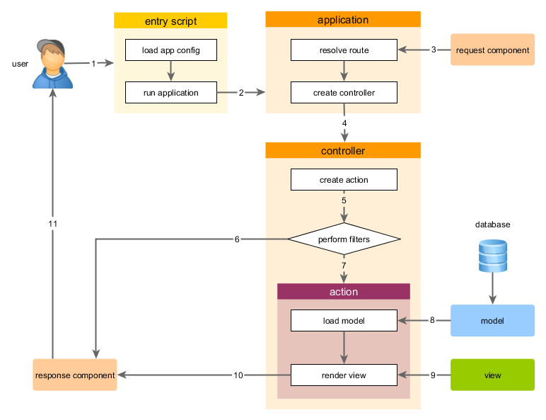

Applikationen aufsetzen
=======================

Nach der Installation von Yii haben Sie eine funktionierende Yii Applikation die via URL `http://hostname/basic/web/index.php`
aufgerufen werden kann (abhängig Ihrer Konfiguration). Dieses Kapitel wird Sie in die standarmässig eingebaute Funktionalität
der Applikation einführen und wie die Applikation strukturiert ist und generell Requests behandelt.

> Info: Der Einfachheit halber wird in diesem "Einstieg"s-Tutorial davon ausgegangen, dass Sie `basic/web` als document
  root Ihres Webservers gesetzt haben und ihn so konfiguriert habe, dass die URL der Applikation `http://hostname/index.php`
  oder so ähnlich ist. Passen Sie die URL auf Ihre Bedürfnisse an gemäss der Beschreibung.
  
Anders als das Framework selber gehört das Projekt nach der Installation ganz Ihnen. Sie können hinzufügen und löschen
was und wo sie möchten.

Funktionalität <span id="functionality"></span>
--------------

Die Basisapplikation enthält vier Seiten:

* die Startseite, erreichbar unter `http://hostname/index.php`,
* die "About" Seite,
* die "Contact" Seite, welche ein Kontaktformular zeigt welches Besuchern gestattet, sie via Mail zu kontaktieren
* sowie die "Login" Seite, welche ein Loginformular darstellt. Dieses kann benutzt werden um Benutzer zu identifizieren.
  Versuchen Sie sich einzuloggen mit "admin/admin" und Sie werden feststellen, dass das "Login" Hauptmenüelement sich
  ändert zu "Logout".

Diese Seiten teilen sich einen gemeinsamen Header sowie Footer. Der Header enthält das Hauptmenü welches die Navigation
durch die verschiedenen Seiten gewährleistet.

Sie sollten ausserdem eine Toolbar zuunterst des Browserfensters sehen.
Dies ist ein nützliches [Debugger Tool](https://github.com/yiisoft/yii2-debug/blob/master/docs/guide/README.md) von Yii
zum Aufzeichnen sowie darstellen von vielen Debugging Informationen wie Log Nachrichten, Antwort Status', Datenbank Queries usw.

Zusätzlich zur Webapplikation gibt es ein Konsolenskript namens `yii`. Dieses befindet sich im Hauptverzeichnis der Applikation.
Dieses Skript kann verwendet werden um Wartungsarbeiten im Hintergrund durchzuführen. Diese sind beschrieben im Kapitel
[Konsolenapplikation](tutorial-console.md)

Applikationsstruktur <span id="application-structure"></span>
--------------------

Die wichtigsten Verzeichnisse und Dateien Ihrer Applikationen sind (angenommen das Stammverzeichnis heisst `basic`):

```
basic/                  Stammverzeichnis der Applikation
    composer.json       Verwendet von Composer, enthält Paketinformationen
    config/             Enthält Konfigurationen für die Applikation (und weitere)
        console.php     Die Konsolenapplikationskonfiguration
        web.php         Die Webapplikationskonfiguration
    commands/           Enthält Konsolenapplikations-Controller
    controllers/        Enthält Webapplikations-Controller
    models/             Enthält Models
    runtime/            Enthält von Yii zur Laufzeit generierte Dateien wie Logs oder Caches
    vendor/             Enthält Composer Pakete einschliesslich Yii selber
    views/              Enthält View-Dateien (Templates)
    web/                Das Webapplikations-Stammverzeichnis. Enthält die per Web aufrufbaren Dateien
        assets/         Enhält veröffentlichte Assets wie Javascript und CSS Dateien
        index.php       Das "Entry"-Skript der Web-Applikation
    yii                 Das Yii Konsolenapplikationsskript 
```

Allgemein gesagt können die Dateien der Applikation in zwei Typen geteilt werden: Die unter `basic/web` und die in anderen
Verzeichnissen. Erstere können direkt via HTTP aufgerufen werden wobei die anderen dies nicht können und dürfen.

Yii implementiert das [Model View Controller (MVC)](https://de.wikipedia.org/wiki/Model_View_Controller) Muster, welches
in obiger Verzeichnisstruktur abgebildet ist. Das `models`-Verzeichnis enthält alle [Model Klassen](structure-models.md),
das `views`-Verzeichnis alle [Vies Skripts](structure-views.md) und das `controllers`-Verzeichnis alle 
[Controller Klassen](structure-controllers.md).

Das folgende Diagramm zeigt die statische Struktur einer Applikation:


Jede Applikation hat ein "Entry"-Skript `web/index.php` welches das einzige aus dem Web aufrufbare PHP Skript der Applikation
darstellt. Das Entry-Skript nimm eingehende Anfragen entgegen und erstellt eine [Applikations](structure-applications.md)-Instanz
um sie zu verarbeiten. Die [Applikation](structure-applications.md) löst die Anfrage auf mit Hilfe ihrer 
[Komponenten](concept-components.md) und übergibt die Anfrage dann an ihre MVC-Elemente. [Widgets](structure-widgets.md)
werden verwendet in [Views](structure-views.md) zur Vereinfachten Darstellung von komplexen und dynamischen Interface Elementen.


Lebenszyklus von Anfragen <span id="request-lifecycle"></span>
-------------------------

Folgendes Diagramm zeigt wie eine Anfrage von einer Applikation behandelt wird:



1. Der Benutzer macht eine Anfrage an das [Entry-Skript](structure-entry-scripts.md) `web/index.php`
2. Das Entry-Skript lädt die [Applikationskonfiguration](concept-configurations.md) und erstellt eine
   [Applikationsinstanz](structure-applications.md) zur Verarbeitung der Anfrage
3. Die Applikation löst den [Route-Parameter](runtime-routing.md) der Anfrage mit Hilfe des [Request](runtime-requests.md)
   Komponenten der Applikation auf
4. Die Applikation erstellt eine [Controller-Instanz](structure-controllers.md) zur Behandlung der Abfrage
5. Der Controller erstellt eine [Action-Instanz](structure-controllers.md) und führt die entsprechenden Filter für die
   Aktion aus
6. Falls ein Filter fehlschlägt, wird die Aktion abgebrochen
7. Falls alle Filter erfolgreich ausgeführt wurden, wird die Aktion ausgeführt
8. Die Aktion lädt Daten in Models z.B. aus einer Datenbank
9. Die Aktion rendert eine View und übergibt die geladenen Daten an diese
10. Das Resultat wird der [Response-Komponente](runtime-responses.md) der Applikation übergeben
11. Die Response-Komponente sendet das Resultat zum Browser des Benutzers

